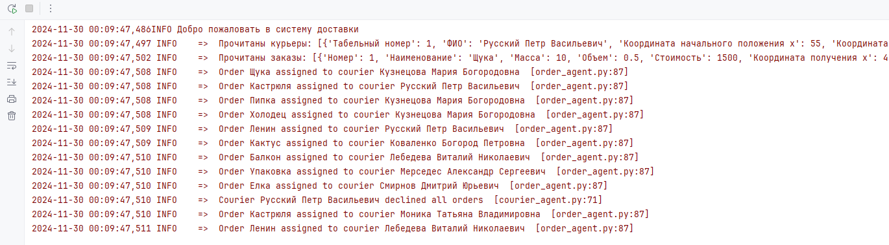
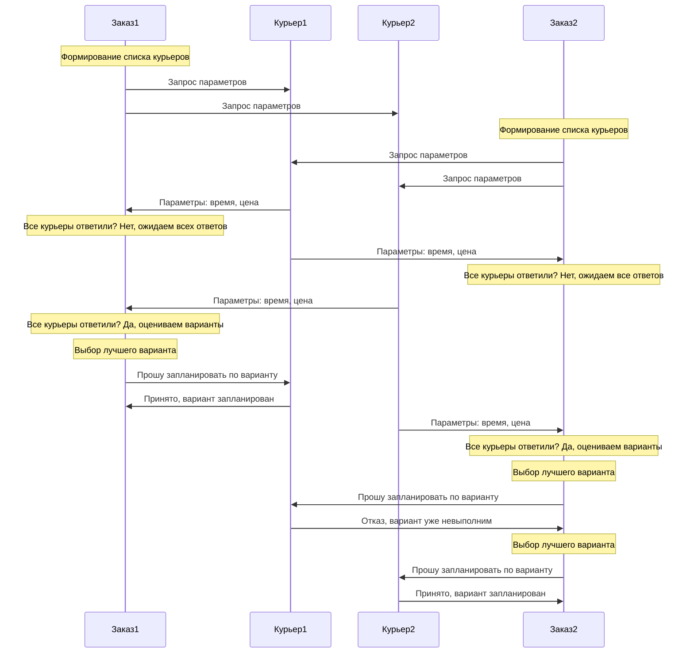
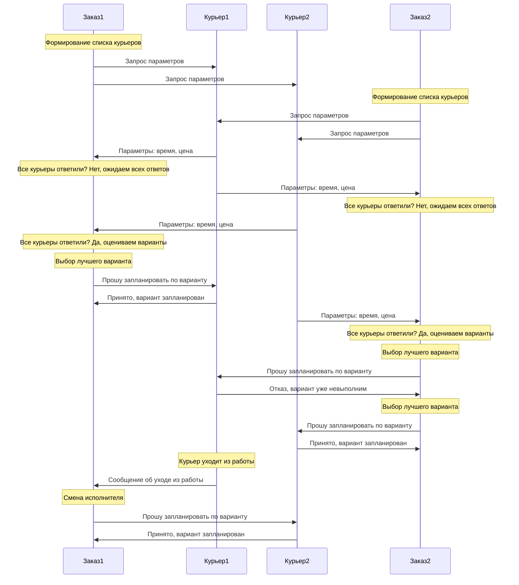

## Мультиагентная система доставки заказов

Выполнена в рамках курса "Разработка мультиагентных систем для управления
мобильными ресурсами на языке программирования Python"

Автор: студент группы 2-ИАИТ-114м Прыгунов Максим Иванович

2024 год. СамГТУ 

### Запуск программы:

Точка входу в программу находится по пути: `lab6/main.py`

Возможности программы:
- После удаления агента курьера из системы, его заказы перераспределяются между оставшимися агентами.
- После удаления агента заказа из системы, его курьер освобождается.
- При определении лучшего курьера, агент заказа учитывает расстояние, текущую загруженность курьера заказами, оставшееся место у него в рюкзаке - влезет заказ или нет.

### Структура программы:
- `agent_base.py` - базовый класс агента
- `courier_agent.py` - класс агента курьера
- `order_agent.py` - класс агента заказа
- `base_entity.py` - базовый класс сущности
- `courier_entity.py` - класс сущности курьера
- `order_entity.py` - класс сущности заказа
- `message.py` - класс сообщения для обмена между агентами
- `agent_dispatcher.py` - класс диспетчера агентов 
- `main.py` - точка входа в программу

### Пример работы программы:

- После удаления агента `Русский Петр Васильевич` из системы, его заказ `Кастрюля` перераспределился на наиболее подходящего курьера `Моника Татьяна Владимировна`

### sequence диаграмма работы системы:

### sequence диаграмма - выход с работы одного из агентов:

